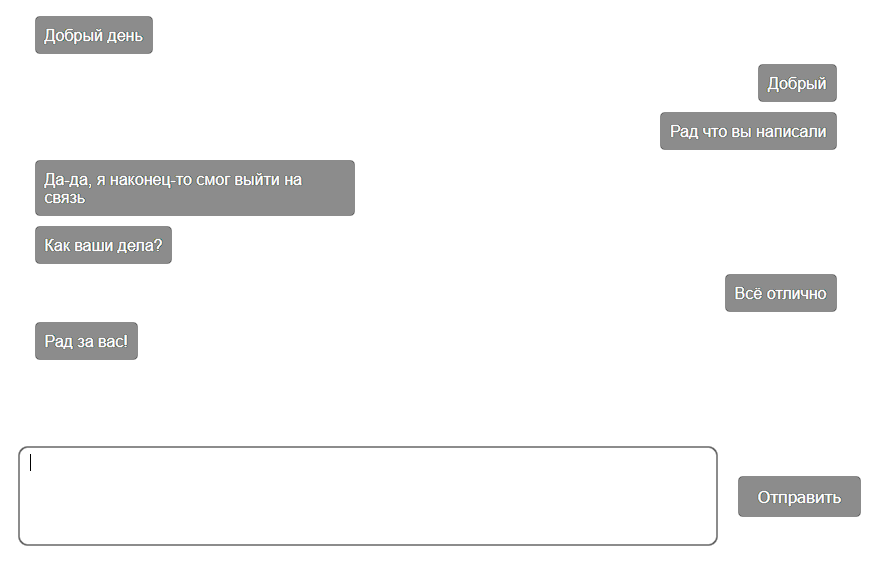

# Лабораторная работа №4
Медведчук Константин КИУКИу-20-2

## Техническое задание
Создать и убедиться в работоспособности клиентской и серверной частей приложения «Чат», реализованного с использованием пакета `socket.io`.

## Скрины

> Скрин диалога от лица первого пользователя
---

> Скрин диалога от лица второго пользователя